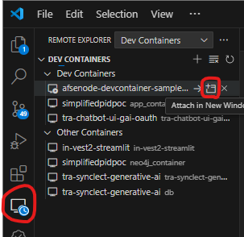
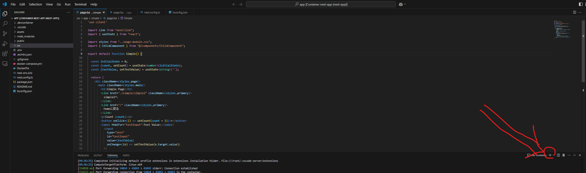

# 開発環境構築方法
1. プロジェクトディレクトリのルートへ移動(./afse.node-devcontainer-sample)
1. コマンド`docker compose build --no-cache`でコンテナを作成する。

# 起動方法
1. プロジェクトディレクトリのルートへ移動(./afse.node-devcontainer-sample)
1. `docker compose up `でコンテナを起動する。
2. 下記方法でDevcontainerを起動
   1. 
3. Devcontainerへ接続しているVS Code上で下記の`+`ボタンを押す。
   1. 
4. `yan dev`を実行する。
5. `http://localhost:3001`へアクセスする。

# 参考サイト
https://qiita.com/piny940/items/e30f219f98bb3b87af18